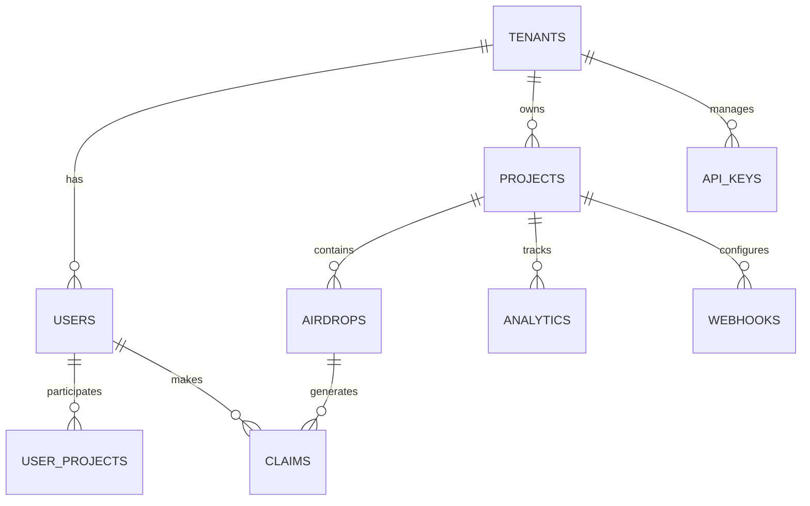

# Database Schema Documentation

This document describes the complete database schema for MochiDrop's multi-tenant SaaS platform.

## 🏗️ Architecture Overview

MochiDrop uses a **multi-tenant architecture** with tenant isolation at the database level. Each tenant (developer/organization) has their own isolated data space while sharing the same application infrastructure.

### Database Technology
- **Primary Database**: PostgreSQL 14+
- **Caching Layer**: Redis 6+
- **Connection Pooling**: PgBouncer
- **Migrations**: Alembic (SQLAlchemy)

## 📊 Schema Overview



## 🏢 Core Tables

### 1. Tenants (Organizations/Developers)

```sql
CREATE TABLE tenants (
    id UUID PRIMARY KEY DEFAULT gen_random_uuid(),
    name VARCHAR(255) NOT NULL,
    slug VARCHAR(100) UNIQUE NOT NULL,
    email VARCHAR(255) UNIQUE NOT NULL,
    plan_type VARCHAR(50) DEFAULT 'free' CHECK (plan_type IN ('free', 'pro', 'enterprise')),
    subscription_status VARCHAR(50) DEFAULT 'active' CHECK (subscription_status IN ('active', 'suspended', 'cancelled')),
    subscription_id VARCHAR(255),
    billing_email VARCHAR(255),
    
    -- Limits based on plan
    max_projects INTEGER DEFAULT 3,
    max_users_per_project INTEGER DEFAULT 1000,
    max_api_calls_per_month INTEGER DEFAULT 10000,
    
    -- Metadata
    settings JSONB DEFAULT '{}',
    created_at TIMESTAMP WITH TIME ZONE DEFAULT NOW(),
    updated_at TIMESTAMP WITH TIME ZONE DEFAULT NOW(),
    deleted_at TIMESTAMP WITH TIME ZONE,
    
    -- Indexes
    CONSTRAINT tenants_slug_check CHECK (slug ~ '^[a-z0-9-]+$')
);

-- Indexes
CREATE INDEX idx_tenants_slug ON tenants(slug);
CREATE INDEX idx_tenants_email ON tenants(email);
CREATE INDEX idx_tenants_plan ON tenants(plan_type);
CREATE INDEX idx_tenants_active ON tenants(subscription_status) WHERE deleted_at IS NULL;
```

### 2. Users (End Users/Participants)

```sql
CREATE TABLE users (
    id UUID PRIMARY KEY DEFAULT gen_random_uuid(),
    tenant_id UUID NOT NULL REFERENCES tenants(id) ON DELETE CASCADE,
    
    -- Identity
    telegram_id BIGINT UNIQUE,
    discord_id VARCHAR(100),
    username VARCHAR(100),
    first_name VARCHAR(255),
    last_name VARCHAR(255),
    email VARCHAR(255),
    
    -- Wallet Information
    wallet_address VARCHAR(44),
    wallet_type VARCHAR(20) DEFAULT 'solana' CHECK (wallet_type IN ('solana', 'ethereum')),
    
    -- Profile
    profile_data JSONB DEFAULT '{}',
    preferences JSONB DEFAULT '{}',
    
    -- Status
    is_active BOOLEAN DEFAULT true,
    is_verified BOOLEAN DEFAULT false,
    verification_data JSONB DEFAULT '{}',
    
    -- Tracking
    referral_code VARCHAR(20) UNIQUE,
    referred_by UUID REFERENCES users(id),
    total_referrals INTEGER DEFAULT 0,
    
    -- Metadata
    created_at TIMESTAMP WITH TIME ZONE DEFAULT NOW(),
    updated_at TIMESTAMP WITH TIME ZONE DEFAULT NOW(),
    last_active_at TIMESTAMP WITH TIME ZONE DEFAULT NOW(),
    
    -- Multi-tenant constraint
    CONSTRAINT users_tenant_telegram UNIQUE (tenant_id, telegram_id),
    CONSTRAINT users_wallet_format CHECK (
        wallet_address IS NULL OR 
        (wallet_type = 'solana' AND length(wallet_address) BETWEEN 32 AND 44) OR
        (wallet_type = 'ethereum' AND wallet_address ~ '^0x[a-fA-F0-9]{40}$')
    )
);

-- Indexes
CREATE INDEX idx_users_tenant_id ON users(tenant_id);
CREATE INDEX idx_users_telegram_id ON users(telegram_id);
CREATE INDEX idx_users_wallet_address ON users(wallet_address);
CREATE INDEX idx_users_referral_code ON users(referral_code);
CREATE INDEX idx_users_active ON users(tenant_id, is_active) WHERE is_active = true;
```

### 3. Projects (Airdrop Campaigns)

```sql
CREATE TABLE projects (
    id UUID PRIMARY KEY DEFAULT gen_random_uuid(),
    tenant_id UUID NOT NULL REFERENCES tenants(id) ON DELETE CASCADE,
    
    -- Basic Information
    name VARCHAR(255) NOT NULL,
    description TEXT,
    project_key VARCHAR(50) UNIQUE NOT NULL,
    
    -- Token Information
    token_name VARCHAR(100),
    token_symbol VARCHAR(20),
    token_address VARCHAR(44),
    token_decimals INTEGER DEFAULT 9,
    total_supply BIGINT,
    
    -- Project Configuration
    settings JSONB DEFAULT '{}',
    requirements JSONB DEFAULT '{}',
    
    -- Wallet & Distribution
    project_wallet_address VARCHAR(44) NOT NULL,
    project_wallet_private_key_encrypted TEXT,
    distribution_rules JSONB DEFAULT '{}',
    
    -- Limits & Controls
    max_participants INTEGER,
    max_claims_per_user INTEGER DEFAULT 1,
    claim_amount BIGINT,
    
    -- Status & Timing
    is_active BOOLEAN DEFAULT true,
    is_public BOOLEAN DEFAULT true,
    start_date TIMESTAMP WITH TIME ZONE,
    end_date TIMESTAMP WITH TIME ZONE,
    
    -- Analytics
    total_participants INTEGER DEFAULT 0,
    total_claims INTEGER DEFAULT 0,
    total_distributed BIGINT DEFAULT 0,
    
    -- Metadata
    created_at TIMESTAMP WITH TIME ZONE DEFAULT NOW(),
    updated_at TIMESTAMP WITH TIME ZONE DEFAULT NOW(),
    
    -- Constraints
    CONSTRAINT projects_dates_check CHECK (end_date IS NULL OR start_date < end_date),
    CONSTRAINT projects_amounts_positive CHECK (claim_amount > 0)
);

-- Indexes
CREATE INDEX idx_projects_tenant_id ON projects(tenant_id);
CREATE INDEX idx_projects_key ON projects(project_key);
CREATE INDEX idx_projects_active ON projects(is_active, is_public);
CREATE INDEX idx_projects_dates ON projects(start_date, end_date);
CREATE INDEX idx_projects_token ON projects(token_address);
```

### 4. User Projects (Participation Tracking)

```sql
CREATE TABLE user_projects (
    id UUID PRIMARY KEY DEFAULT gen_random_uuid(),
    user_id UUID NOT NULL REFERENCES users(id) ON DELETE CASCADE,
    project_id UUID NOT NULL REFERENCES projects(id) ON DELETE CASCADE,
    
    -- Participation Status
    joined_at TIMESTAMP WITH TIME ZONE DEFAULT NOW(),
    status VARCHAR(50) DEFAULT 'active' CHECK (status IN ('active', 'banned', 'left')),
    
    -- Progress Tracking
    tasks_completed JSONB DEFAULT '[]',
    points_earned INTEGER DEFAULT 0,
    level INTEGER DEFAULT 1,
    
    -- Verification
    verification_status VARCHAR(50) DEFAULT 'pending' CHECK (
        verification_status IN ('pending', 'verified', 'rejected')
    ),
    verification_data JSONB DEFAULT '{}',
    
    -- Metadata
    metadata JSONB DEFAULT '{}',
    updated_at TIMESTAMP WITH TIME ZONE DEFAULT NOW(),
    
    -- Constraints
    CONSTRAINT user_projects_unique UNIQUE (user_id, project_id)
);

-- Indexes
CREATE INDEX idx_user_projects_user_id ON user_projects(user_id);
CREATE INDEX idx_user_projects_project_id ON user_projects(project_id);
CREATE INDEX idx_user_projects_status ON user_projects(project_id, status);
CREATE INDEX idx_user_projects_points ON user_projects(project_id, points_earned DESC);
```

### 5. Airdrops (Distribution Events)

```sql
CREATE TABLE airdrops (
    id UUID PRIMARY KEY DEFAULT gen_random_uuid(),
    project_id UUID NOT NULL REFERENCES projects(id) ON DELETE CASCADE,
    
    -- Basic Information
    name VARCHAR(255) NOT NULL,
    description TEXT,
    airdrop_type VARCHAR(50) DEFAULT 'manual' CHECK (
        airdrop_type IN ('manual', 'automatic', 'scheduled', 'milestone')
    ),
    
    -- Distribution Details
    token_amount BIGINT NOT NULL,
    recipients_count INTEGER DEFAULT 0,
    
    -- Eligibility Criteria
    eligibility_rules JSONB DEFAULT '{}',
    min_points_required INTEGER DEFAULT 0,
    min_level_required INTEGER DEFAULT 1,
    
    -- Timing
    scheduled_at TIMESTAMP WITH TIME ZONE,
    executed_at TIMESTAMP WITH TIME ZONE,
    
    -- Status
    status VARCHAR(50) DEFAULT 'pending' CHECK (
        status IN ('pending', 'processing', 'completed', 'failed', 'cancelled')
    ),
    
    -- Results
    success_count INTEGER DEFAULT 0,
    failure_count INTEGER DEFAULT 0,
    total_distributed BIGINT DEFAULT 0,
    
    -- Transaction Details
    transaction_signatures TEXT[],
    gas_fees_paid BIGINT DEFAULT 0,
    
    -- Metadata
    metadata JSONB DEFAULT '{}',
    created_at TIMESTAMP WITH TIME ZONE DEFAULT NOW(),
    updated_at TIMESTAMP WITH TIME ZONE DEFAULT NOW(),
    
    -- Constraints
    CONSTRAINT airdrops_amount_positive CHECK (token_amount > 0)
);

-- Indexes
CREATE INDEX idx_airdrops_project_id ON airdrops(project_id);
CREATE INDEX idx_airdrops_status ON airdrops(status);
CREATE INDEX idx_airdrops_scheduled ON airdrops(scheduled_at) WHERE scheduled_at IS NOT NULL;
CREATE INDEX idx_airdrops_type ON airdrops(airdrop_type);
```

### 6. Claims (Individual Token Claims)

```sql
CREATE TABLE claims (
    id UUID PRIMARY KEY DEFAULT gen_random_uuid(),
    user_id UUID NOT NULL REFERENCES users(id) ON DELETE CASCADE,
    project_id UUID NOT NULL REFERENCES projects(id) ON DELETE CASCADE,
    airdrop_id UUID REFERENCES airdrops(id) ON DELETE SET NULL,
    
    -- Claim Details
    amount BIGINT NOT NULL,
    token_address VARCHAR(44) NOT NULL,
    
    -- Transaction Information
    transaction_signature VARCHAR(128),
    block_height BIGINT,
    
    -- Status Tracking
    status VARCHAR(50) DEFAULT 'pending' CHECK (
        status IN ('pending', 'processing', 'completed', 'failed', 'expired')
    ),
    
    -- Timing
    claimed_at TIMESTAMP WITH TIME ZONE DEFAULT NOW(),
    processed_at TIMESTAMP WITH TIME ZONE,
    expires_at TIMESTAMP WITH TIME ZONE,
    
    -- Error Handling
    error_message TEXT,
    retry_count INTEGER DEFAULT 0,
    
    -- Metadata
    metadata JSONB DEFAULT '{}',
    
    -- Constraints
    CONSTRAINT claims_unique_user_project UNIQUE (user_id, project_id),
    CONSTRAINT claims_amount_positive CHECK (amount > 0)
);

-- Indexes
CREATE INDEX idx_claims_user_id ON claims(user_id);
CREATE INDEX idx_claims_project_id ON claims(project_id);
CREATE INDEX idx_claims_airdrop_id ON claims(airdrop_id);
CREATE INDEX idx_claims_status ON claims(status);
CREATE INDEX idx_claims_transaction ON claims(transaction_signature);
CREATE INDEX idx_claims_pending ON claims(status, claimed_at) WHERE status = 'pending';
```

## 🔐 Authentication & API Tables

### 7. API Keys

```sql
CREATE TABLE api_keys (
    id UUID PRIMARY KEY DEFAULT gen_random_uuid(),
    tenant_id UUID NOT NULL REFERENCES tenants(id) ON DELETE CASCADE,
    
    -- Key Information
    key_id VARCHAR(50) UNIQUE NOT NULL, -- Public identifier (mk_live_...)
    key_hash VARCHAR(128) NOT NULL,     -- Hashed secret
    name VARCHAR(255),
    
    -- Permissions
    permissions JSONB DEFAULT '["read"]',
    scopes TEXT[] DEFAULT ARRAY['projects:read'],
    
    -- Usage Tracking
    last_used_at TIMESTAMP WITH TIME ZONE,
    usage_count BIGINT DEFAULT 0,
    
    -- Rate Limiting
    rate_limit_per_hour INTEGER DEFAULT 1000,
    rate_limit_per_day INTEGER DEFAULT 10000,
    
    -- Status
    is_active BOOLEAN DEFAULT true,
    expires_at TIMESTAMP WITH TIME ZONE,
    
    -- Metadata
    created_at TIMESTAMP WITH TIME ZONE DEFAULT NOW(),
    updated_at TIMESTAMP WITH TIME ZONE DEFAULT NOW(),
    
    -- Security
    created_by_ip INET,
    last_used_ip INET
);

-- Indexes
CREATE INDEX idx_api_keys_tenant_id ON api_keys(tenant_id);
CREATE INDEX idx_api_keys_key_id ON api_keys(key_id);
CREATE INDEX idx_api_keys_active ON api_keys(is_active) WHERE is_active = true;
```

### 8. Sessions

```sql
CREATE TABLE sessions (
    id UUID PRIMARY KEY DEFAULT gen_random_uuid(),
    tenant_id UUID NOT NULL REFERENCES tenants(id) ON DELETE CASCADE,
    
    -- Session Data
    session_token VARCHAR(128) UNIQUE NOT NULL,
    refresh_token VARCHAR(128) UNIQUE,
    
    -- User Information
    user_email VARCHAR(255) NOT NULL,
    user_data JSONB DEFAULT '{}',
    
    -- Timing
    created_at TIMESTAMP WITH TIME ZONE DEFAULT NOW(),
    expires_at TIMESTAMP WITH TIME ZONE NOT NULL,
    last_accessed_at TIMESTAMP WITH TIME ZONE DEFAULT NOW(),
    
    -- Security
    ip_address INET,
    user_agent TEXT,
    
    -- Status
    is_active BOOLEAN DEFAULT true
);

-- Indexes
CREATE INDEX idx_sessions_token ON sessions(session_token);
CREATE INDEX idx_sessions_tenant ON sessions(tenant_id);
CREATE INDEX idx_sessions_expires ON sessions(expires_at);
CREATE INDEX idx_sessions_active ON sessions(is_active) WHERE is_active = true;
```

## 📊 Analytics & Monitoring Tables

### 9. Analytics Events

```sql
CREATE TABLE analytics_events (
    id UUID PRIMARY KEY DEFAULT gen_random_uuid(),
    tenant_id UUID NOT NULL REFERENCES tenants(id) ON DELETE CASCADE,
    project_id UUID REFERENCES projects(id) ON DELETE CASCADE,
    user_id UUID REFERENCES users(id) ON DELETE SET NULL,
    
    -- Event Information
    event_type VARCHAR(100) NOT NULL,
    event_name VARCHAR(255) NOT NULL,
    
    -- Event Data
    properties JSONB DEFAULT '{}',
    user_properties JSONB DEFAULT '{}',
    
    -- Context
    session_id VARCHAR(128),
    ip_address INET,
    user_agent TEXT,
    
    -- Timing
    timestamp TIMESTAMP WITH TIME ZONE DEFAULT NOW(),
    
    -- Metadata
    metadata JSONB DEFAULT '{}'
);

-- Indexes (Partitioned by month for performance)
CREATE INDEX idx_analytics_tenant_time ON analytics_events(tenant_id, timestamp DESC);
CREATE INDEX idx_analytics_project_time ON analytics_events(project_id, timestamp DESC);
CREATE INDEX idx_analytics_event_type ON analytics_events(event_type, timestamp DESC);
CREATE INDEX idx_analytics_user_time ON analytics_events(user_id, timestamp DESC);
```

### 10. Webhooks

```sql
CREATE TABLE webhooks (
    id UUID PRIMARY KEY DEFAULT gen_random_uuid(),
    tenant_id UUID NOT NULL REFERENCES tenants(id) ON DELETE CASCADE,
    project_id UUID REFERENCES projects(id) ON DELETE CASCADE,
    
    -- Webhook Configuration
    url VARCHAR(2048) NOT NULL,
    secret VARCHAR(128),
    
    -- Event Subscriptions
    events TEXT[] NOT NULL DEFAULT ARRAY['user.joined', 'claim.completed'],
    
    -- Status
    is_active BOOLEAN DEFAULT true,
    
    -- Delivery Settings
    retry_count INTEGER DEFAULT 3,
    timeout_seconds INTEGER DEFAULT 30,
    
    -- Statistics
    total_deliveries INTEGER DEFAULT 0,
    successful_deliveries INTEGER DEFAULT 0,
    failed_deliveries INTEGER DEFAULT 0,
    last_delivery_at TIMESTAMP WITH TIME ZONE,
    last_success_at TIMESTAMP WITH TIME ZONE,
    
    -- Metadata
    created_at TIMESTAMP WITH TIME ZONE DEFAULT NOW(),
    updated_at TIMESTAMP WITH TIME ZONE DEFAULT NOW()
);

-- Indexes
CREATE INDEX idx_webhooks_tenant_id ON webhooks(tenant_id);
CREATE INDEX idx_webhooks_project_id ON webhooks(project_id);
CREATE INDEX idx_webhooks_active ON webhooks(is_active) WHERE is_active = true;
```

### 11. Webhook Deliveries

```sql
CREATE TABLE webhook_deliveries (
    id UUID PRIMARY KEY DEFAULT gen_random_uuid(),
    webhook_id UUID NOT NULL REFERENCES webhooks(id) ON DELETE CASCADE,
    
    -- Delivery Information
    event_type VARCHAR(100) NOT NULL,
    payload JSONB NOT NULL,
    
    -- HTTP Details
    http_status INTEGER,
    response_body TEXT,
    response_headers JSONB,
    
    -- Timing
    attempted_at TIMESTAMP WITH TIME ZONE DEFAULT NOW(),
    completed_at TIMESTAMP WITH TIME ZONE,
    duration_ms INTEGER,
    
    -- Status
    status VARCHAR(50) DEFAULT 'pending' CHECK (
        status IN ('pending', 'success', 'failed', 'timeout')
    ),
    
    -- Error Information
    error_message TEXT,
    retry_attempt INTEGER DEFAULT 0
);

-- Indexes
CREATE INDEX idx_webhook_deliveries_webhook_id ON webhook_deliveries(webhook_id);
CREATE INDEX idx_webhook_deliveries_status ON webhook_deliveries(status);
CREATE INDEX idx_webhook_deliveries_attempted ON webhook_deliveries(attempted_at DESC);
```

## 🔄 System Tables

### 12. Schema Migrations

```sql
CREATE TABLE schema_migrations (
    version VARCHAR(255) PRIMARY KEY,
    applied_at TIMESTAMP WITH TIME ZONE DEFAULT NOW(),
    execution_time_ms INTEGER
);
```

### 13. System Settings

```sql
CREATE TABLE system_settings (
    key VARCHAR(255) PRIMARY KEY,
    value JSONB NOT NULL,
    description TEXT,
    updated_at TIMESTAMP WITH TIME ZONE DEFAULT NOW(),
    updated_by VARCHAR(255)
);

-- Default settings
INSERT INTO system_settings (key, value, description) VALUES
('maintenance_mode', 'false', 'Enable/disable maintenance mode'),
('max_file_upload_size', '10485760', 'Maximum file upload size in bytes'),
('default_rate_limits', '{"free": 100, "pro": 10000, "enterprise": 100000}', 'Default API rate limits per plan'),
('supported_tokens', '["SOL", "USDC", "BONK"]', 'List of supported token types');
```

## 🔍 Views and Functions

### Useful Views

```sql
-- Active Projects Summary
CREATE VIEW active_projects_summary AS
SELECT 
    p.id,
    p.name,
    p.tenant_id,
    t.name as tenant_name,
    p.total_participants,
    p.total_claims,
    p.total_distributed,
    p.created_at
FROM projects p
JOIN tenants t ON p.tenant_id = t.id
WHERE p.is_active = true AND t.deleted_at IS NULL;

-- User Statistics
CREATE VIEW user_statistics AS
SELECT 
    u.id,
    u.tenant_id,
    u.username,
    COUNT(up.project_id) as projects_joined,
    COUNT(c.id) as total_claims,
    COALESCE(SUM(c.amount), 0) as total_claimed,
    u.total_referrals,
    u.created_at
FROM users u
LEFT JOIN user_projects up ON u.id = up.user_id
LEFT JOIN claims c ON u.id = c.user_id AND c.status = 'completed'
GROUP BY u.id;

-- Tenant Usage Summary
CREATE VIEW tenant_usage_summary AS
SELECT 
    t.id,
    t.name,
    t.plan_type,
    COUNT(DISTINCT p.id) as total_projects,
    COUNT(DISTINCT u.id) as total_users,
    COUNT(DISTINCT ak.id) as total_api_keys,
    t.created_at
FROM tenants t
LEFT JOIN projects p ON t.id = p.tenant_id
LEFT JOIN users u ON t.id = u.tenant_id
LEFT JOIN api_keys ak ON t.id = ak.tenant_id
WHERE t.deleted_at IS NULL
GROUP BY t.id;
```

### Useful Functions

```sql
-- Generate Project Key
CREATE OR REPLACE FUNCTION generate_project_key()
RETURNS VARCHAR(50) AS $$
DECLARE
    key_candidate VARCHAR(50);
    key_exists BOOLEAN;
BEGIN
    LOOP
        key_candidate := 'proj_' || substr(md5(random()::text), 1, 12);
        SELECT EXISTS(SELECT 1 FROM projects WHERE project_key = key_candidate) INTO key_exists;
        IF NOT key_exists THEN
            RETURN key_candidate;
        END IF;
    END LOOP;
END;
$$ LANGUAGE plpgsql;

-- Update Project Statistics
CREATE OR REPLACE FUNCTION update_project_stats(project_uuid UUID)
RETURNS VOID AS $$
BEGIN
    UPDATE projects SET
        total_participants = (
            SELECT COUNT(*) FROM user_projects 
            WHERE project_id = project_uuid AND status = 'active'
        ),
        total_claims = (
            SELECT COUNT(*) FROM claims 
            WHERE project_id = project_uuid AND status = 'completed'
        ),
        total_distributed = (
            SELECT COALESCE(SUM(amount), 0) FROM claims 
            WHERE project_id = project_uuid AND status = 'completed'
        ),
        updated_at = NOW()
    WHERE id = project_uuid;
END;
$$ LANGUAGE plpgsql;
```

## 🔒 Security Considerations

### Row Level Security (RLS)

```sql
-- Enable RLS on tenant-specific tables
ALTER TABLE users ENABLE ROW LEVEL SECURITY;
ALTER TABLE projects ENABLE ROW LEVEL SECURITY;
ALTER TABLE claims ENABLE ROW LEVEL SECURITY;

-- Tenant isolation policies
CREATE POLICY tenant_isolation_users ON users
    FOR ALL TO application_role
    USING (tenant_id = current_setting('app.current_tenant_id')::UUID);

CREATE POLICY tenant_isolation_projects ON projects
    FOR ALL TO application_role
    USING (tenant_id = current_setting('app.current_tenant_id')::UUID);
```

### Data Encryption

```sql
-- Encrypt sensitive fields
CREATE EXTENSION IF NOT EXISTS pgcrypto;

-- Example: Encrypt private keys
UPDATE projects SET 
    project_wallet_private_key_encrypted = pgp_sym_encrypt(
        project_wallet_private_key, 
        current_setting('app.encryption_key')
    );
```

## 📈 Performance Optimization

### Partitioning

```sql
-- Partition analytics_events by month
CREATE TABLE analytics_events_y2024m01 PARTITION OF analytics_events
    FOR VALUES FROM ('2024-01-01') TO ('2024-02-01');

CREATE TABLE analytics_events_y2024m02 PARTITION OF analytics_events
    FOR VALUES FROM ('2024-02-01') TO ('2024-03-01');
```

### Indexes for Performance

```sql
-- Composite indexes for common queries
CREATE INDEX idx_users_tenant_active ON users(tenant_id, is_active) WHERE is_active = true;
CREATE INDEX idx_claims_project_status ON claims(project_id, status, claimed_at);
CREATE INDEX idx_analytics_tenant_type_time ON analytics_events(tenant_id, event_type, timestamp DESC);

-- Partial indexes for better performance
CREATE INDEX idx_pending_claims ON claims(claimed_at) WHERE status = 'pending';
CREATE INDEX idx_active_webhooks ON webhooks(tenant_id) WHERE is_active = true;
```

## 🔧 Maintenance Scripts

### Cleanup Old Data

```sql
-- Clean up old sessions (older than 30 days)
DELETE FROM sessions 
WHERE expires_at < NOW() - INTERVAL '30 days';

-- Archive old analytics events (older than 1 year)
INSERT INTO analytics_events_archive 
SELECT * FROM analytics_events 
WHERE timestamp < NOW() - INTERVAL '1 year';

DELETE FROM analytics_events 
WHERE timestamp < NOW() - INTERVAL '1 year';
```

### Health Checks

```sql
-- Check for orphaned records
SELECT 'Orphaned users' as issue, COUNT(*) as count
FROM users u 
LEFT JOIN tenants t ON u.tenant_id = t.id 
WHERE t.id IS NULL

UNION ALL

SELECT 'Orphaned projects' as issue, COUNT(*) as count
FROM projects p 
LEFT JOIN tenants t ON p.tenant_id = t.id 
WHERE t.id IS NULL;
```

## 📋 Migration Guide

### From Single-Tenant to Multi-Tenant

```sql
-- 1. Add tenant_id to existing tables
ALTER TABLE users ADD COLUMN tenant_id UUID;
ALTER TABLE projects ADD COLUMN tenant_id UUID;

-- 2. Create default tenant
INSERT INTO tenants (id, name, slug, email) 
VALUES (gen_random_uuid(), 'Default Tenant', 'default', 'admin@example.com');

-- 3. Update existing records
UPDATE users SET tenant_id = (SELECT id FROM tenants WHERE slug = 'default');
UPDATE projects SET tenant_id = (SELECT id FROM tenants WHERE slug = 'default');

-- 4. Add constraints
ALTER TABLE users ALTER COLUMN tenant_id SET NOT NULL;
ALTER TABLE projects ALTER COLUMN tenant_id SET NOT NULL;
```

---

## 📞 Support

For database-related questions:
- 📧 **Technical Support**: tech@mochidrop.com
- 🐛 **Report Schema Issues**: [GitHub Issues](https://github.com/dreyxd/MochiDrop/issues)
- 📚 **Full Documentation**: [Database Docs](https://dreyxd.github.io/MochiDrop/docs/database/)

This schema is designed for scalability, security, and performance. Regular maintenance and monitoring are recommended for optimal operation.